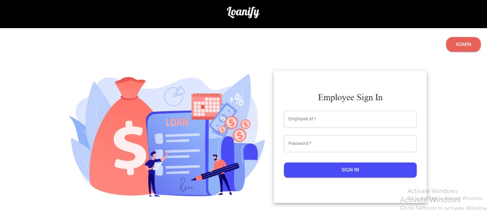
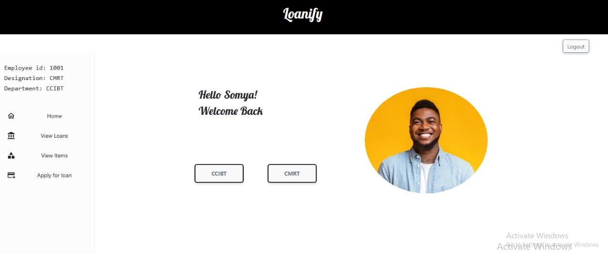
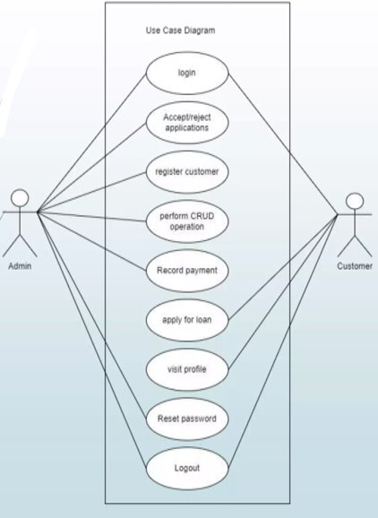
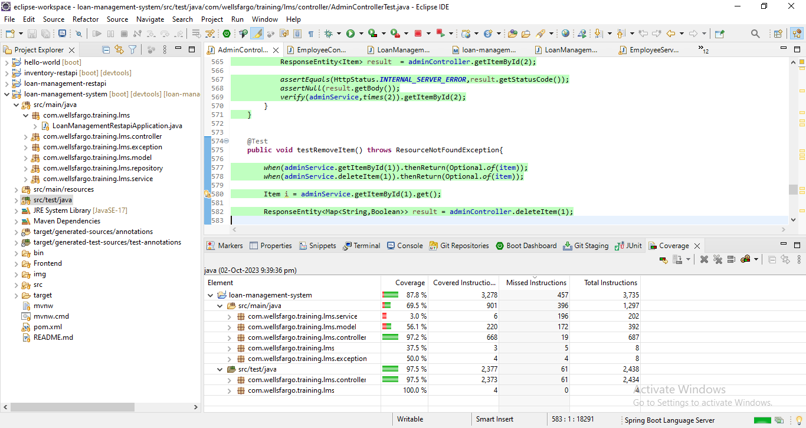

# Loanify

*Modern robust Loan Management System usable by both the Admin and the Employees​*





### Live

### Installation

#### `Step 1` - clone the repo

```bash
$ git clone [https://github.com/MadhumithaJR/loan-management-system]
```

#### `Step 2` - cd in the repo

```bash
$ cd loan-management-system
```

#### `Step 3` - install dependencies

```bash
$ npm install
```

#### `Step 4` - run application

```bash
$ npm run start
```

In browser, open [http://localhost:3000](http://localhost:3000)


## API Architecture



## Main Features

- [x] - Allow the admin and user to login and validate the credentials​

- [x] - Allow the admin to manage customer data, existing loan cards, item cards for inventory​

- [x] - Allow the user to view loans, apply for loans, view items purchased​

- [x] - React Based Frontend

- [x] - Spring Based Backend

- [x] - Fetch APIs

- [x] - MariaDB SQL database

- [x] - User Friendly UI


## Junit Test Results



Link to power point presentation:
https://learnermanipal-my.sharepoint.com/:p:/g/personal/rishabh_agarwal_learner_manipal_edu/Eb6X2kvAr9tPqHTUUpzHRMIBcMooA6XGwVSM5FF5oRBwEg?rtime=fEETBXzD20g

